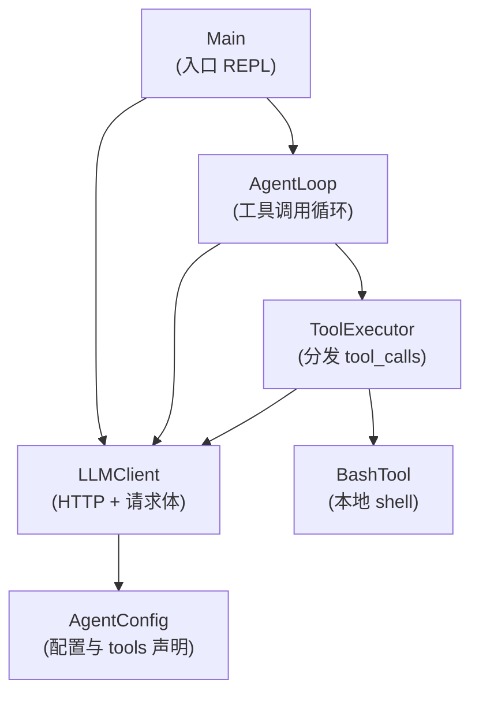
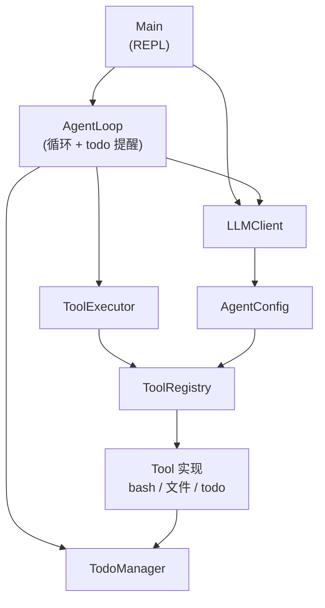

# learn-java-agent

使用 Java 搭建 agent 的学习之路，涉及 tools、skills、上下文管理等。

## 一、Agent 初步搭建的说明

包 **`com.learn.javaagent.Agent01`** 实现了一个基于「对话 + 工具调用」的 Agent：与 OpenAI **Chat Completions** 兼容的 **`tools` / `tool_calls`** 模式，通过 **`LLMClient`**、**`AgentLoop`**、**`ToolExecutor`** 与 **`BashTool`** 协作完成多轮推理与本地 shell 执行。更完整的独立排版见 [`docs/Agent01.md`](docs/Agent01.md)。

### 1. 整体思路：Agent = 多轮对话 + 模型决策 + 工具执行

1. 用户输入被追加为一条 `role: user` 消息。
2. **`LLMClient`** 把 **system 提示词**、历史消息、`tools` 声明等打成一次请求，调用网关的 `/chat/completions`。
3. **`AgentLoop`** 解析响应：若助手消息里带有 **`tool_calls`**，则交给 **`ToolExecutor`** 执行，并把结果以 **`role: tool`** 写回同一条对话历史，再请求模型，直到某次助手回复不再要求工具。
4. 当前唯一实现的工具是 **`bash`**，由 **`BashTool`** 在本地进程里执行 shell 命令。

因此，这是一个典型的 **ReAct 式「想—做—再看结果」循环**，只是「想」和「是否继续」由模型通过结构化 `tool_calls` 表达。

### 2. 类依赖关系（谁依赖谁）



- **`Main`** 只直接依赖 **`LLMClient`** 与 **`AgentLoop`**。
- **`AgentLoop`** 依赖 **`LLMClient`**（发请求）和 **`ToolExecutor`**（执行工具）。
- **`ToolExecutor`** 依赖 **`LLMClient`**（取 bash 工具名）和 **`BashTool`**（真正跑命令）。
- **`LLMClient`** 依赖 **`AgentConfig`**（运行期配置、`tools` JSON、默认参数）。
- **`AgentConfig`** 与 **`BashTool`** 不依赖包内其他业务类（配置自洽；`BashTool` 为包内工具实现）。

### 3. 各类职责与主要方法

#### 3.1 `Main` — 程序入口与控制台 REPL

| 作用 | 说明 |
|------|------|
| **职责** | 创建 `LLMClient`、维护 `JsonArray` 对话历史；在控制台循环读用户输入，拼 `user` 消息并调用 `AgentLoop.run`，最后打印本轮最后一条消息的文本内容。 |
| **`main(String[] args)`** | 持续提示「用户输入 >>」，读到空行、`q`、`exit` 或 EOF 则退出；否则将输入 trim 后作为 `role`/`content` 加入 `history`，调用 `AgentLoop.run(history, llm)`，再从 `history` 最后一条取 `content` 打印（若存在且为 primitive）。 |

依赖：**`LLMClient`**、**`AgentLoop`**，以及 Gson 的 `JsonArray` / `JsonObject`。

#### 3.2 `AgentLoop` — 「直到没有 tool_calls」的循环

| 作用 | 说明 |
|------|------|
| **职责** | 实现 Agent 的核心控制流：反复调用 `llm.completeChat(messages)`，把返回的 **assistant** 消息追加到 `messages`；若含 **`tool_calls`**，则对每条调用 `ToolExecutor.executeToolCall`，把 **`role: tool`** 消息追加，再请求模型，直到某次 assistant 没有工具调用。 |
| **`run(JsonArray messages, LLMClient llm)`** | 就地修改 `messages`；解析 JSON 根对象的 `choices[0].message`；遇 `error` 或缺 `choices` 抛异常；有 `tool_calls` 则循环执行工具并继续 while。 |

依赖：**`LLMClient`**、**`ToolExecutor`**。

#### 3.3 `AgentConfig` — 配置、工具 Schema、System 提示词

| 作用 | 说明 |
|------|------|
| **职责** | 集中常量（如 `API_KEY`、`MODEL_ID`、`API_BASE_URL`、默认网关、`TOOL_NAME_BASH`）、从 classpath 的 `agent.properties` 与环境变量 **`load()`**（环境覆盖文件，且若配置了 `API_BASE_URL` 会移除 `API_AUTH_TOKEN`）、**`tools()`** 返回 OpenAI 兼容的 **`function` 声明**（当前仅 `bash` + `command` 参数）、**`systemPrompt()`**（含当前工作目录的简短 system 文案）、**`loadRuntime()`** 校验必填并生成 **`RuntimeConfig`**。 |
| **`RuntimeConfig`**（内部静态类） | 不可变快照：`apiKey`、`modelId`、`apiBaseUrl`、`systemPrompt`；供 `LLMClient` 构造使用。 |

被 **`LLMClient`** 使用；**`ToolExecutor`** 通过 `LLMClient.bashToolName()` 间接与 `AgentConfig.TOOL_NAME_BASH` 对齐。

#### 3.4 `LLMClient` — 与网关的一次 Chat Completions 封装

| 作用 | 说明 |
|------|------|
| **职责** | 构造时 **`AgentConfig.loadRuntime()`**（或注入 `RuntimeConfig`）；把 **system + 多轮对话**、`model`、`tools`、`tool_choice`、`max_tokens` 组装为请求体，**POST** 到 `{apiBaseUrl}/chat/completions`，Bearer 鉴权，读响应字符串。 |
| **无参构造** | `new LLMClient()` → `loadRuntime()`。 |
| **`LLMClient(RuntimeConfig)`** | 便于测试或外部预先解析配置。 |
| **`bashToolName()`** | 返回与声明一致的工具名（`AgentConfig.TOOL_NAME_BASH`），供 `ToolExecutor` 分发。 |
| **`completeChat(JsonArray conversationMessages)`** | 在消息数组前插入一条 system（内容来自 `RuntimeConfig.getSystemPrompt()`），再拼接传入的历史，设置 `model`、`tools`、`tool_choice`、`max_tokens`，调用私有 **`postChatCompletions`**。 |
| **私有 `postChatCompletions` / `postJson`** | 发 HTTP、处理非 200 抛错；**`readFully`** 读流为字符串。 |

依赖：**`AgentConfig`**（及内层 **`RuntimeConfig`**）。

#### 3.5 `ToolExecutor` — 把一条 `tool_calls` 项变成 `role: tool` 消息

| 作用 | 说明 |
|------|------|
| **职责** | 从 `tool_calls[]` 单条中取 `id`、`function.name`、`function.arguments`；若 `name` 不是配置的 bash 名，返回错误文本的 tool 消息；否则解析 JSON 参数中的 **`command`**，打印高亮的 `$ command` 与截断后的输出，把 **`BashTool.run(cmd)`** 的字符串作为 **`content`** 写回。 |
| **`ToolExecutor(LLMClient llm)`** | 用 `llm.bashToolName()` 作为期望的工具名。 |
| **`ToolExecutor(String bashToolName)`** | 可直接传入工具名字符串。 |
| **`executeToolCall(JsonObject toolCall)`** | 返回待追加到历史的 **`role: tool`** + **`tool_call_id`** + **`content`**。 |
| **`parseCommand`** | 从 `arguments` JSON 取 `command`；异常或空则得空串。 |
| **`str`** | 安全从 `JsonObject` 取字符串字段。 |

依赖：**`LLMClient`**（仅用于工具名）、**`BashTool`**。

#### 3.6 `BashTool` — 本地执行 shell（包内 `final class`）

| 作用 | 说明 |
|------|------|
| **职责** | 在**当前工作目录**（`Paths.get("").toAbsolutePath()`）下执行命令；合并 stdout/stderr；**120 秒**超时强杀；输出过长截断；含简单**危险命令子串拦截**（如 `rm -rf /`、`sudo` 等）。 |
| **`run(String command)`** | Windows 用 `cmd.exe /c`，否则 `/bin/sh -c`；返回字符串（错误或 `(no output)` 等）。 |
| **`readAll`** | 读进程流。 |

无对其它 Agent01 类的依赖，仅被 **`ToolExecutor`** 调用。

### 4. 数据在系统里如何流动（一句话串起来）

用户一行输入 → **`Main`** 写入 **`history`**（Gson `JsonArray`）→ **`AgentLoop.run`** 循环：**`LLMClient.completeChat`** 带 **system + 全历史 + tools** 请求模型 → 若有 **`tool_calls`**，**`ToolExecutor`** 调 **`BashTool.run`**，结果作为 **tool** 消息追加 → 再请求直到无工具 → **`Main`** 打印最后一条消息的 **`content`**（通常是模型最终自然语言回复）。

### 5. 小结：这个「Agent」在架构上的位置

| 层次 | 类 | 角色 |
|------|-----|------|
| 入口 | `Main` | I/O 与对话列表生命周期 |
| 编排 | `AgentLoop` | 多轮「模型 ↔ 工具」直到收敛 |
| 模型网关 | `LLMClient` + `AgentConfig` | 鉴权、URL、system/tools/参数 |
| 工具层 | `ToolExecutor` + `BashTool` | 将模型结构化调用落地为本地动作 |

若你后续要扩展（例如增加文件读写、HTTP 请求等），通常只需：在 **`AgentConfig.tools()`** 里增加 **function** 声明，在 **`ToolExecutor.executeToolCall`** 里按 `name` 分支，并实现对应工具类，**`AgentLoop`** 与 **`Main`** 的结构可以保持不变——这正是这类 **function-calling Agent** 的可扩展点。

### 6. 安全提示

`src/main/resources/agent.properties` 中的 **API_KEY** 等敏感信息请勿提交到公开仓库；生产环境建议使用环境变量或密钥管理服务。

---

## 二、支持多工具注入与任务规划

包 **`com.learn.javaagent.Agent02`** 在 Agent01 的 Chat Completions + `tool_calls` 模式上，将工具抽象为统一接口 **`Tool`**，由 **`ToolRegistry`** 同时生成 OpenAI 兼容的 **`tools`** 声明并按名 **`dispatch`** 执行；**`ToolExecutor`** 只负责解析 `tool_calls` 条目并写回 **`role: tool`**，不再硬编码单一 bash 分支。运行时通过 **`TodoManager`** 与 **`todo`** 工具维护多步计划（同一时间仅允许一个 **`in_progress`**），**`AgentLoop`** 在连续多轮未调用 todo 时向工具结果中注入提醒，引导模型更新计划。完整类图、模块说明、设计要点与序列图见 **[`docs/Agent02.md`](docs/Agent02.md)**。

### 1. 整体思路：注册表 + 会话状态 + 计划纠偏

1. **`AgentConfig.tools()`** 与 **`systemPrompt()`** 均基于 **`ToolRegistry`**，保证模型看到的工具列表与本地可执行集合一致。
2. **`LLMClient`** 仍负责一次请求的 HTTP 与请求体（system、历史、`tools`、`tool_choice`、`max_tokens`）。
3. **`AgentLoop`** 解析 assistant；若有 **`tool_calls`**，交给 **`ToolExecutor`** → **`ToolRegistry.dispatch`**；**`TodoTool`** 与 **`AgentLoop`** 共享同一会话 **`TodoManager`**。
4. 标准工具除 **`bash`** 外，还包括 **`read_file`**、**`write_file`**、**`edit_file`**（路径限制在当前工作目录下）以及 **`todo`**。

### 2. 类依赖关系（精简）



### 3. 调用流程（一句话）

用户输入写入 **`history`** → **`AgentLoop.run`** 循环调用 **`LLMClient.completeChat`** → 若有 **`tool_calls`** 则 **`ToolRegistry`** 执行对应 **`Tool`**（含 **`todo`** 更新 **`TodoManager`**），必要时注入计划提醒 → 直到 assistant 不再带工具 → **`Main`** 打印最后一条 **`content`**。

### 4. 运行入口

控制台入口主类为 **`com.learn.javaagent.Agent02.runtime.Main`**（配置方式与上文「配置」章节相同）。

---

## 构建

本项目为 **Maven** 工程，**源码级别 Java 8**（`maven.compiler.source` / `target` 为 `1.8`），运行需 **JDK 8 及以上**。

```bash
mvn compile
mvn package
```

在 IntelliJ IDEA 中导入 **Maven** 项目，将 **Project SDK** 设为 **8**。可运行主类 **`com.learn.javaagent.Agent01.Main`**（单 bash 工具示例）或 **`com.learn.javaagent.Agent02.runtime.Main`**（多工具 + 任务规划，见上文「二、支持多工具注入与任务规划」）。入口通过对应包的 **`LLMClient`** 构造时加载 **`AgentConfig.loadRuntime()`**；模型、提示词、工具等由 **`LLMClient`** 提供给 **`AgentLoop`**。

## 配置

- 默认从 **`src/main/resources/agent.properties`**（UTF-8）读取 **`API_KEY`**、**`MODEL_ID`**、**`API_BASE_URL`** 等键。
- **同名环境变量会覆盖** 文件中的值（便于部署时注入密钥，勿在仓库中提交含真实密钥的 properties）。
- **`API_KEY`**、**`MODEL_ID`** 为必填（可在文件或环境中提供）。
- 未设置 **`API_BASE_URL`** 时，使用内置默认：**`https://dashscope.aliyuncs.com/compatible-mode/v1`**，实际请求为 **OpenAI 兼容** **`…/compatible-mode/v1/chat/completions`**，鉴权为 **`Authorization: Bearer`**。
- 若只配置到主机（如 `https://dashscope.aliyuncs.com`），代码会补上 **`/compatible-mode/v1/chat/completions`**。
