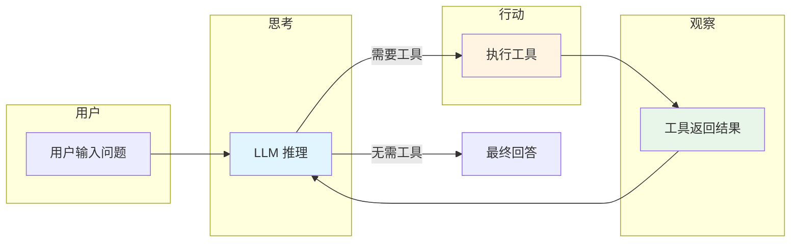
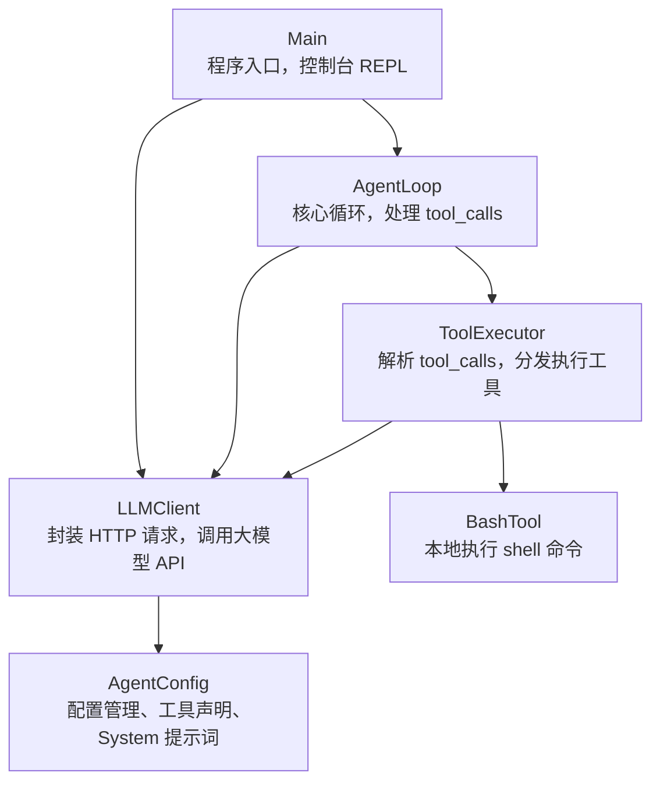
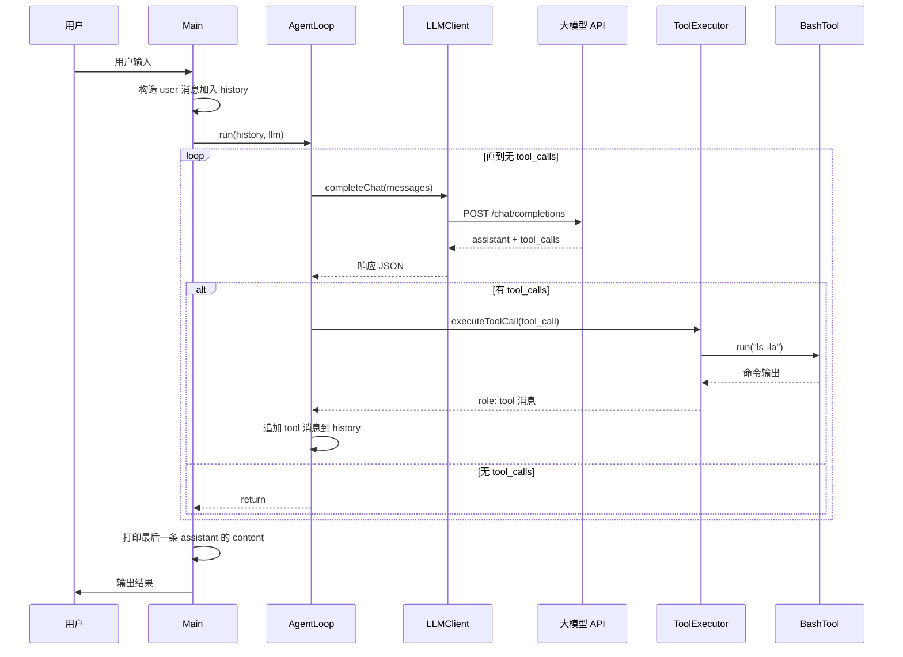
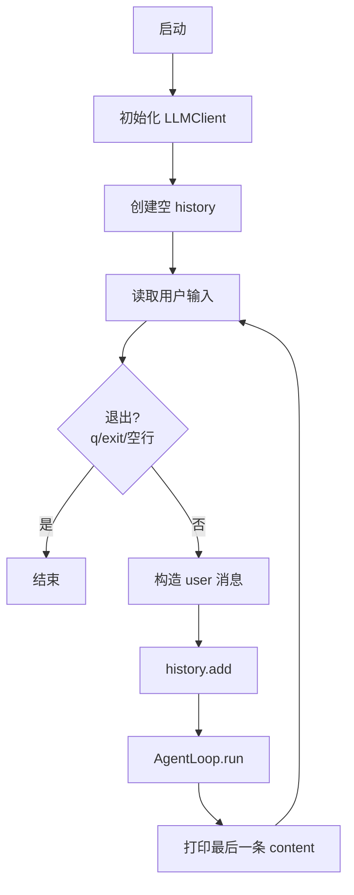
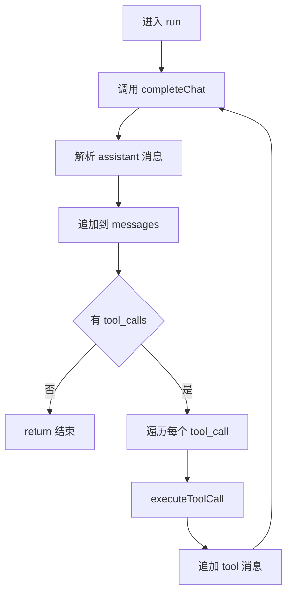
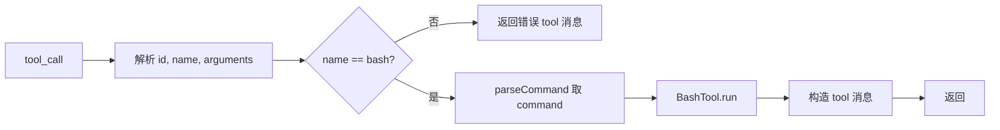
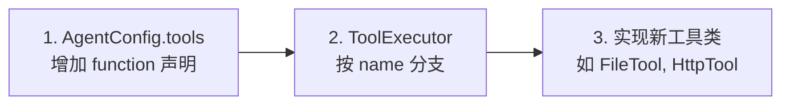
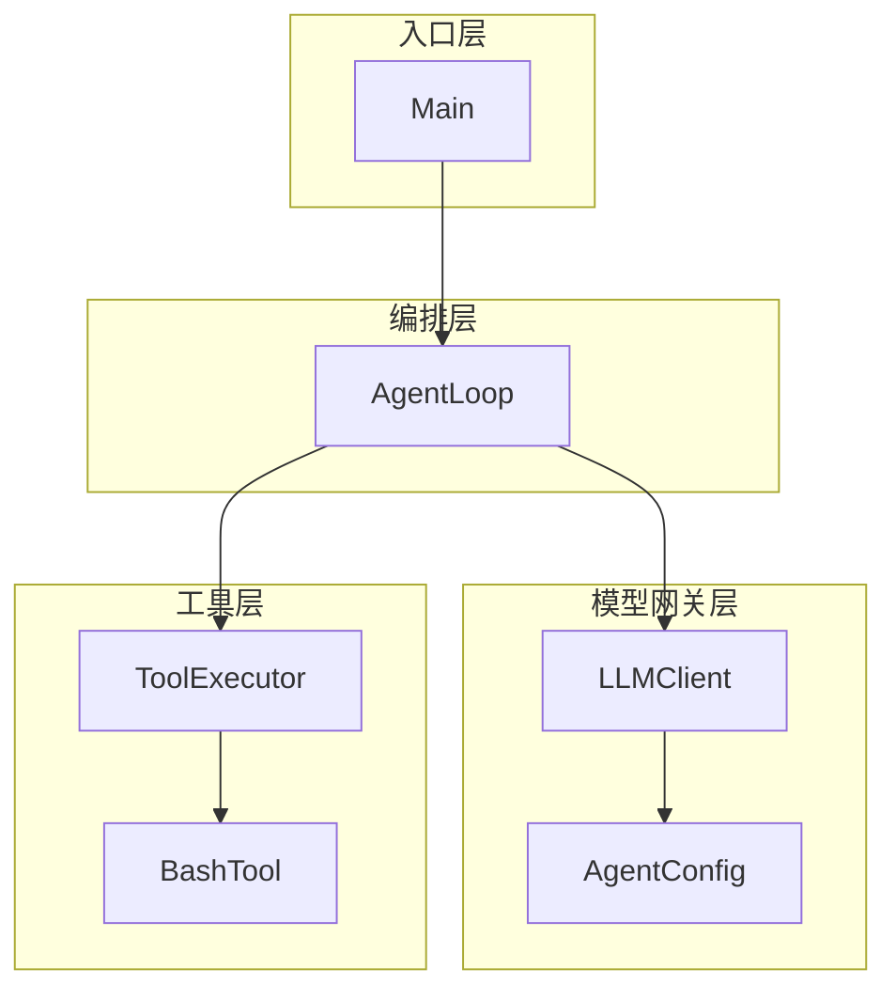

# Agent01 架构与流程说明

> 基于 ReAct 模式的 Java Agent 完整技术文档

> **图解**：本文档配有 HTML 版流程图，可在浏览器中打开 [`agent01-diagrams.html`](agent01-diagrams.html) 查看。

---

## 一、核心逻辑：想 → 做 → 再看结果

本 Agent 采用经典的 **ReAct 模式**（Reasoning + Acting），即「思考 → 行动 → 观察」的循环：

```
用户输入问题 → LLM 判断是否需要工具 → 执行工具并返回结果 → LLM 基于结果给出回答
```

### 1.1 ReAct 循环流程图



### 1.2 与 OpenAI API 的对应关系

| 概念 | 实现方式 |
|------|----------|
| 模型推理 | Chat Completions API |
| 工具声明 | `tools` 数组（function 定义） |
| 工具调用 | `tool_calls` 结构化输出 |
| 工具结果 | `role: tool` 消息 |

---

## 二、类结构全景图

### 2.1 六大核心组件及依赖关系



### 2.2 职责速览表

| 类名 | 职责 | 依赖 |
|------|------|------|
| **Main** | 程序入口，控制台 REPL 交互 | LLMClient, AgentLoop |
| **AgentLoop** | 核心循环，处理 tool_calls 直到收敛 | LLMClient, ToolExecutor |
| **LLMClient** | 封装 HTTP 请求，调用大模型 API | AgentConfig |
| **AgentConfig** | 配置管理、工具声明、System 提示词 | 无 |
| **ToolExecutor** | 解析 tool_calls，分发执行工具 | LLMClient, BashTool |
| **BashTool** | 本地执行 shell 命令（含安全拦截） | 无 |

---

## 三、完整数据流转：一次对话的全过程

以用户提问「查看当前目录下有哪些文件？」为例：

### 3.1 数据流转流程图



### 3.2 逐步拆解

| 步骤 | 组件 | 动作 |
|------|------|------|
| 1 | Main | 读取输入，构造 `{"role":"user","content":"..."}` 加入 history |
| 2 | AgentLoop | 进入 while 循环，调用 `LLMClient.completeChat(history)` |
| 3 | LLMClient | 组装请求：system + history + tools，POST 到 /chat/completions |
| 4 | LLM | 返回 assistant 消息，含 `tool_calls`: bash + `{"command":"ls -la"}` |
| 5 | AgentLoop | 检测到 tool_calls，调用 `ToolExecutor.executeToolCall()` |
| 6 | ToolExecutor | 解析 command，调用 `BashTool.run("ls -la")` |
| 7 | BashTool | 执行命令，返回文件列表 |
| 8 | ToolExecutor | 构造 `{"role":"tool","tool_call_id":"...","content":"..."}` 加入 history |
| 9 | AgentLoop | 循环继续，再次调用 LLM，此次无 tool_calls |
| 10 | AgentLoop | 发现无 tool_calls，return 结束 |
| 11 | Main | 打印最后一条 assistant 的 content |

---

## 四、逐类实现细节

### 4.1 Main：程序的「大门」

**职责**：控制台 REPL、维护对话历史、调用 AgentLoop、打印最终回复。

**核心流程**：



**关键代码逻辑**：
- 退出条件：`q`、`exit`、空行、EOF
- 每条用户输入包装为 `role: user` 消息
- 调用 `AgentLoop.run(history, llm)` 执行完整推理
- 打印 `history` 最后一条消息的 `content`

---

### 4.2 AgentLoop：Agent 的「大脑中枢」

**职责**：实现「直到没有 tool_calls 才停止」的循环逻辑。

**核心流程图**：



---

### 4.3 LLMClient：与 AI 模型通信的「信使」

**职责**：构造请求体、鉴权、发送 HTTP、解析响应。

**请求体结构**：

| 字段 | 说明 |
|------|------|
| messages | [system] + 历史对话 |
| model | 模型 ID |
| tools | 工具声明（bash 等） |
| tool_choice | "auto" |
| max_tokens | 8000 |

---

### 4.4 AgentConfig：配置的「管家」

**职责**：集中管理 API 密钥、模型 ID、工具声明、System 提示词。

**工具声明示例**（OpenAI 兼容格式）：

```json
[{
  "type": "function",
  "function": {
    "name": "bash",
    "description": "Run a shell command.",
    "parameters": {
      "type": "object",
      "properties": { "command": { "type": "string" } },
      "required": ["command"]
    }
  }
}]
```

**System 提示词**：`"You are a coding agent at {cwd}. Use bash to solve tasks. Act, don't explain."`

---

### 4.5 ToolExecutor：工具调用的「调度员」

**职责**：解析 tool_calls，按 name 分发，构造 role: tool 消息。

**执行流程**：



---

### 4.6 BashTool：本地命令的「执行者」

**职责**：执行 shell 命令，含安全拦截与超时控制。

**安全特性**：

| 措施 | 说明 |
|------|------|
| 黑名单 | `rm -rf /`、`sudo`、`shutdown`、`reboot`、`> /dev/` |
| 超时 | 120 秒，超时强制终止 |
| 输出截断 | 最多 50,000 字符 |
| 跨平台 | Windows 用 cmd.exe，Unix 用 /bin/sh |

---

## 五、扩展新工具的三步法



| 步骤 | 位置 | 动作 |
|------|------|------|
| 1 | `AgentConfig.tools()` | 增加新的 function 声明（name、description、parameters） |
| 2 | `ToolExecutor.executeToolCall()` | 按 `name` 增加分支，调用新工具 |
| 3 | 新建类 | 实现工具逻辑（如 FileTool、HttpTool） |

**无需修改**：Main、AgentLoop 结构保持不变。

---

## 六、架构分层总结



| 层次 | 类 | 角色 |
|------|-----|------|
| 入口 | Main | I/O 与对话列表生命周期 |
| 编排 | AgentLoop | 多轮「模型 ↔ 工具」直到收敛 |
| 模型网关 | LLMClient + AgentConfig | 鉴权、URL、system/tools/参数 |
| 工具层 | ToolExecutor + BashTool | 将模型结构化调用落地为本地动作 |

---

## 七、核心能力小结

| 能力 | 实现 |
|------|------|
| 多轮对话 | 维护 JsonArray 历史，支持上下文 |
| 工具调用 | OpenAI 兼容 tools / tool_calls |
| 循环决策 | ReAct：直到无 tool_calls 才停止 |
| 安全控制 | 命令黑名单、120s 超时、输出截断 |

---

## 八、安全提示

- `agent.properties` 中的 **API_KEY** 请勿提交到公开仓库
- 生产环境建议使用环境变量或密钥管理服务
