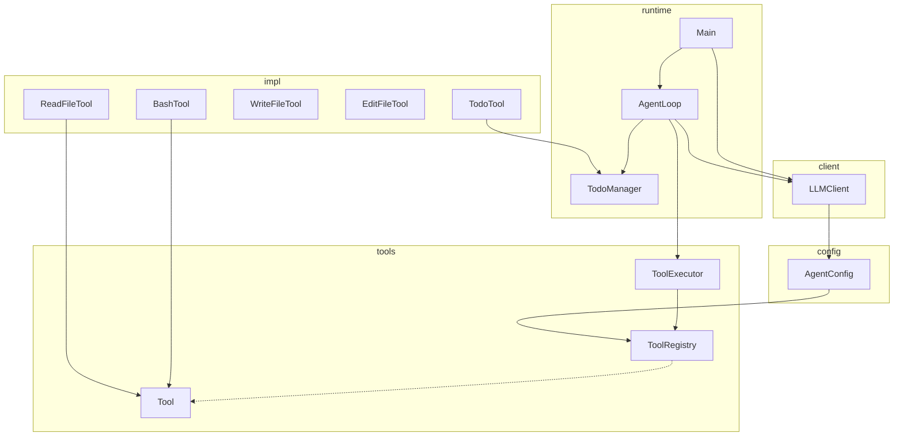
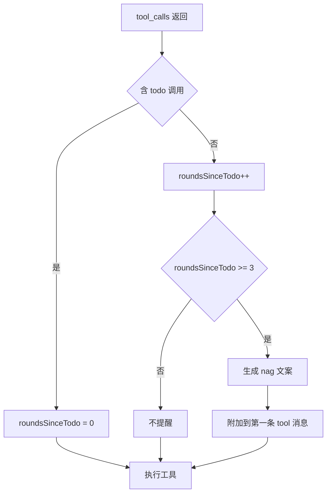
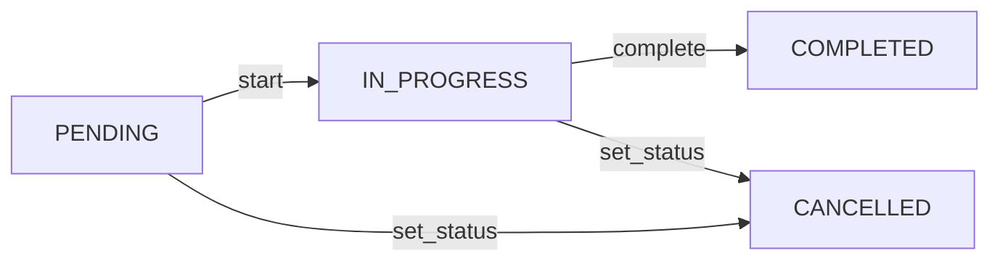

# Agent02：多工具注册与任务规划状态管理

> 在 Agent01 基础上实现三大升级：多工具注册中心、任务规划状态管理、智能提醒机制

> **图解**：可在浏览器中打开 [`agent02-diagrams.html`](agent02-diagrams.html) 查看架构图。

---

## 一、三大核心升级

| 升级点 | 说明 |
|--------|------|
| **多工具注册中心** | 从硬编码分支 → 统一 Tool 接口 + ToolRegistry 注册表 |
| **任务规划状态管理** | 引入 TodoManager + TodoTool，支持多步任务拆解与状态流转 |
| **智能提醒机制** | 连续 3 轮未调用 todo 时自动注入提醒，引导模型更新计划 |

### 设计思路

多步任务中，模型容易**丢失进度**：重复做过的事、跳步、跑偏。对话越长越严重：工具结果不断填满上下文，系统提示的影响力逐渐被稀释。

**TodoManager + TodoTool** 让模型可以：
- 拆解任务并记录执行状态
- 先列步骤再动手
- 按 PENDING → IN_PROGRESS → COMPLETED 有序推进

---

## 二、Agent01 vs Agent02 对比

| 特性 | Agent01 | Agent02 |
|------|---------|---------|
| **工具数量** | 1 个（bash） | 5 个（bash、read_file、write_file、edit_file、todo） |
| **工具扩展** | 修改 ToolExecutor 的 if-else 分支 | 实现 Tool 接口 + 注册到 ToolRegistry |
| **任务规划** | 无 | TodoManager + TodoTool 完整状态管理 |
| **提醒机制** | 无 | 3 轮未调用 todo 自动提醒 |
| **日志系统** | 简单 System.out | AgentLogger 统一封装 |

---

## 三、核心组件详解

### 3.1 Tool 接口：统一工具契约

Agent01 中 ToolExecutor 硬编码了 bash 判断；Agent02 引入 Tool 接口，所有工具实现统一契约。

**设计亮点**：每个工具同时提供 OpenAI Function 声明（name/description/parametersSchema）和本地执行逻辑（execute）；新增工具只需实现接口并注册，**无需修改执行器代码**。

```java
public interface Tool {
    String name();                    // 与 function.name 一致
    String description();            // 供模型阅读
    JsonObject parametersSchema();   // OpenAI JSON Schema
    String execute(String argumentsJson);

    default JsonObject toOpenAiToolDeclaration() {
        // 组装 type:function + function 声明
    }

    static JsonObject stringProperty(String desc) { ... }
    default Path resolveUnderCwd(String path) { ... }  // 路径安全
}
```

### 3.2 ToolRegistry：工具注册中心

ToolRegistry 是工具的统一管理中心：维护列表、生成 OpenAI 声明、按名分发。

**关键设计：声明与执行同源**。AgentConfig.tools() 直接调用 ToolRegistry.openAiTools()，保证「模型看到的工具」=「服务端能执行的工具」。

| 方法 | 作用 |
|------|------|
| `withStandardTools(todoManager)` | 创建带会话级 TodoManager 的注册表 |
| `openAiTools()` | 供 AgentConfig 使用的静态声明 |
| `dispatch(name, args)` | 按名分发执行 |
| `toolNames()` | 逗号分隔的工具名，用于 system prompt |

**TodoTool 双实例**：STANDARD_DECLARATIONS 中的 TodoTool 仅用于 Schema；运行期由 withStandardTools(todoManager) 注入会话级 TodoManager。

### 3.3 TodoManager：任务规划状态管理

会话级任务计划管理，**强制同一时间只能有一个 in_progress**，complete 前任务必须为 in_progress。

**状态流转**：PENDING → IN_PROGRESS → COMPLETED（CANCELLED 可选）

| 方法 | 约束 |
|------|------|
| `add(title)` | 新增待办 |
| `start(id)` | 若已有 in_progress 则拒绝 |
| `complete(id)` | 仅当任务为 in_progress 时可完成 |
| `snapshot()` | 生成 JSON 快照供模型查看 |

### 3.4 TodoTool：任务规划工具

模型操作任务计划的接口，支持：`add`、`update`、`start`、`complete`、`set_status`、`list`。

**参数**：action（必填）、id、title、status（set_status 时使用）。

### 3.5 智能提醒机制（Nag）

当模型连续 **TODO_NAG_THRESHOLD = 3** 轮未调用 todo 时，将提醒文案附加到**第一条** tool 消息的 content 中。

```
[REMINDER] You have gone N rounds without calling todo.
Update the plan before proceeding.
Current todo snapshot: current_in_progress=..., pending=..., completed=...
```

### 3.6 文件操作工具

| 工具 | 功能 | 安全特性 |
|------|------|----------|
| read_file | 读取 UTF-8 文本 | 5 万字符截断、路径限制工作区 |
| write_file | 创建或覆盖文件 | 自动建父目录、路径限制 |
| edit_file | 精确替换文本片段 | old_string 须唯一匹配、路径限制 |

---

## 四、类结构依赖



---

## 五、Nag 提醒流程



---

## 六、TodoManager 状态流转



**约束**：同一时间仅一个 IN_PROGRESS；complete 前须 IN_PROGRESS。

---

## 七、如何扩展新工具？

| 步骤 | 操作 |
|------|------|
| 1 | 新建类实现 Tool 接口 |
| 2 | 在 ToolRegistry.withStandardTools 中注册 |
| 3 | 在 STANDARD_DECLARATIONS 中同步添加（供 openAiTools） |

**无需修改**：AgentLoop、LLMClient、ToolExecutor 的核心逻辑。

---

## 八、总结

| 层次 | 组件 | 角色 |
|------|------|------|
| 入口 | Main | REPL 与对话历史 |
| 编排 | AgentLoop | 模型 ↔ 工具循环 + todo 提醒 |
| 状态 | TodoManager | 会话级计划、in_progress 唯一性 |
| 网关 | LLMClient + AgentConfig | 鉴权、tools、system |
| 工具层 | Tool + ToolRegistry + ToolExecutor | 声明与执行统一、按名分发 |
| 可观测 | AgentLogger | 推理、工具参数、提醒 |

Agent02 完成三个进化：**工具架构**（接口+注册表）、**任务规划**（TodoManager 状态管理）、**智能提醒**（防忘记更新计划）。
