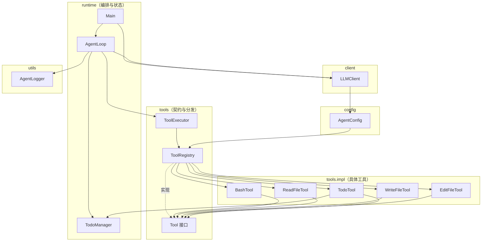
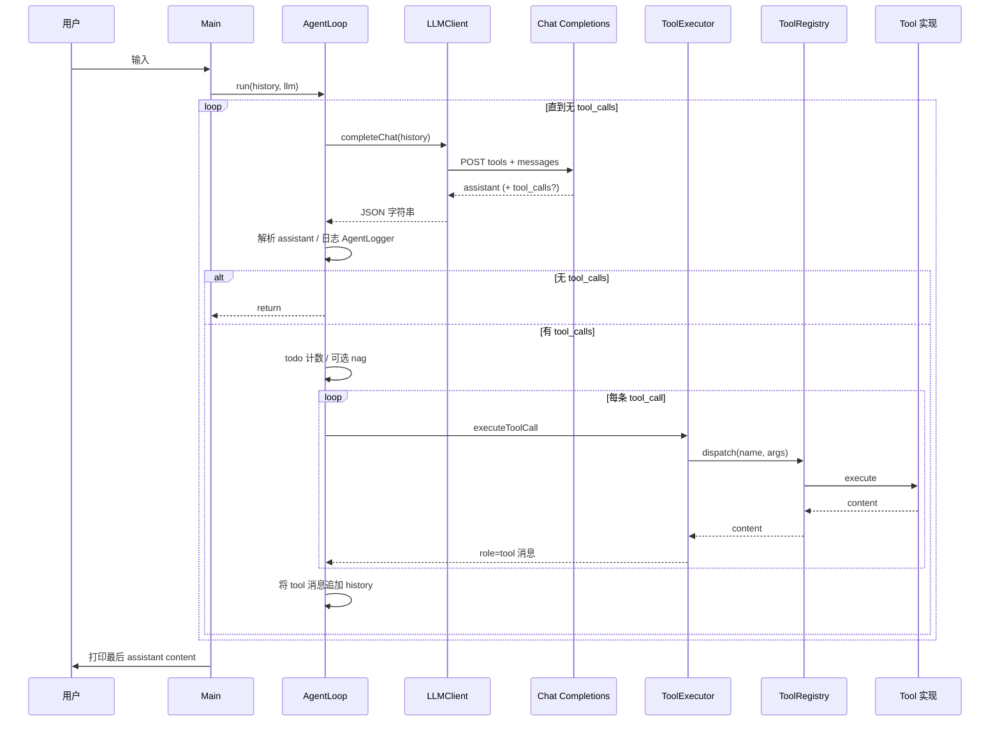

# Agent02：多工具注入与任务规划

包 **`com.learn.javaagent.Agent02`** 在 Agent01「对话 + 单工具（bash）」的基础上，演进为 **可插拔工具契约 + 注册中心分发**，并引入 **`TodoManager` / `todo` 工具** 与 **多轮未调用 todo 时的提醒注入**，形成「模型决策 → 多工具执行 → 计划纠偏」的闭环。

> **详细图解**：参见 [`Agent02-架构与流程说明.md`](Agent02-架构与流程说明.md) 与 [`agent02-diagrams.html`](agent02-diagrams.html)。

---

## 1. 目录与模块划分

| 路径 | 模块角色 |
|------|----------|
| `config/AgentConfig.java` | 从 classpath / 环境变量加载密钥与网关；**`tools()` 与 system 提示词** 与 **`ToolRegistry`** 对齐，保证「声明」与「执行」同源。 |
| `client/LLMClient.java` | Chat Completions HTTP 封装：拼接 system、历史消息、`tools`、`tool_choice`、`max_tokens`。 |
| `runtime/Main.java` | 控制台 REPL：维护 Gson `JsonArray` 对话历史，每轮用户输入后调用 `AgentLoop.run`。 |
| `runtime/AgentLoop.java` | 核心循环：请求模型 → 解析 `tool_calls` → `ToolExecutor` 执行 → 写回 `role: tool`；含 **todo 使用计数与提醒（nag）** 逻辑。 |
| `runtime/TodoManager.java` | 会话内任务计划：增删改状态、**同一时间仅允许一个 `in_progress`**、`complete` 前须为进行中。 |
| `tools/Tool.java` | 工具统一接口：`name` / `description` / `parametersSchema` / `execute`，并提供 OpenAI 声明与路径解析等默认方法。 |
| `tools/ToolRegistry.java` | **注册表**：标准工具列表、`dispatch(name, argumentsJson)`、静态 **`openAiTools()`**（供配置侧引用）。 |
| `tools/ToolExecutor.java` | 将单条 `tool_calls[]` 转为 `role: tool` 消息；**不感知具体工具类型**，只委托 `ToolRegistry`。 |
| `tools/impl/*` | `bash`、`read_file`、`write_file`、`edit_file`、`todo` 的具体实现。 |
| `utils/AgentLogger.java` | 决策轮次、推理字段、工具参数、最终回复与提醒注入的日志输出。 |

---

## 2. 类组织与依赖关系

设计要点：**配置层** 只依赖 **`ToolRegistry` 的静态声明**；**运行时执行** 通过 **`ToolExecutor(TodoManager)`** 注入 **同一会话的 `TodoTool`**，避免「API 里看到的 todo」与「实际改动的状态」脱节。

**依赖说明（简表）**

| 类 | 直接依赖 |
|----|----------|
| `Main` | `LLMClient`、`AgentLoop` |
| `AgentLoop` | `LLMClient`、`ToolExecutor`、`TodoManager`、`AgentLogger` |
| `ToolExecutor` | `ToolRegistry`（构造时可 `withStandardTools(todoManager)`） |
| `LLMClient` | `AgentConfig`（`RuntimeConfig`、`tools()` 等） |
| `AgentConfig` | `ToolRegistry`（`openAiTools()`、`toolNames()`、`systemPrompt()` 文案） |
| `ToolRegistry` | 各 `impl.*` 工具类、`TodoManager`（构建带会话 todo 的注册表时） |
| `TodoTool` | `TodoManager` |
| 文件类工具 | `Tool`（`resolveUnderCwd` 限制在工作区根下） |

**说明：** `ToolRegistry` 中用于生成静态 **`OPENAI_TOOLS`** 的 `STANDARD_DECLARATIONS` 内含一个**仅用于 Schema 的** `TodoTool(new TodoManager())` 实例；真正与用户会话绑定的是 `AgentLoop` 构造时创建的 `TodoManager`，并经 `ToolExecutor(todoManager)` 注入到运行期注册表中的 `TodoTool`。两者职责分离：前者保证类加载时即能生成完整 `tools` JSON，后者保证状态一致。

---

## 3. 设计思路

1. **单一契约（`Tool`）**  
   每个工具同时提供 **OpenAI Function 的 name / description / parameters** 与 **本地 `execute(argumentsJson)`**，新增工具时实现接口并在 `ToolRegistry.withStandardTools`（及如需在静态声明中展示则同步 `STANDARD_DECLARATIONS`）中注册即可，无需在 `ToolExecutor` 里写 `if (name.equals("bash"))` 分支。

2. **声明与分发同源**  
   `AgentConfig.tools()` 返回 `ToolRegistry.openAiTools()`，system 提示中的工具列表来自 `ToolRegistry.toolNames()`，减少「模型看到的工具」与「服务端能执行的工具」不一致的风险。

3. **任务规划（todo）与约束**  
   `TodoManager` 强制 **最多一个 `in_progress`**，且 **`complete` 仅针对当前进行中项**，引导模型按步骤推进。`AgentLoop` 在连续若干轮 **未调用 `todo` 工具** 时，将 **提醒文案** 附加到本轮 **第一条** tool 消息的 `content` 中，督促更新计划。

4. **安全与边界**  
   `read_file` / `write_file` / `edit_file` 通过 `Tool.resolveUnderCwd` 限制在进程当前工作目录内；`bash` 保留简单危险子串拦截与超时、输出截断（与 Agent01 思路一致）。

---

## 4. 调用流程（端到端）

### 4.1 用户一轮对话（高层）

1. **`Main`** 读取用户输入，追加 `role: user` 到 `history`。  
2. **`AgentLoop.run(history, llm)`** 进入循环。  
3. **`LLMClient.completeChat(history)`**：前置 system（含 cwd、工具列表与 todo 使用建议）、附带 **`AgentConfig.tools()`** 请求网关。  
4. 解析响应 `choices[0].message`：  
   - 若无 **`tool_calls`**：将 assistant 消息追加到 `history`，**返回**；**`Main`** 打印最后一条 `content`。  
   - 若有 **`tool_calls`**：追加 assistant；根据是否包含 **`todo`** 更新 `roundsSinceTodo`；必要时生成 **nag** 文案。  
5. 对每条 `tool_call`：**`ToolExecutor.executeToolCall`** → **`ToolRegistry.dispatch`** → 对应 **`Tool.execute`**；若需 nag，将提醒拼入**第一条** tool 的 `content`。  
6. 将各 `role: tool` 消息追加到 `history`，**下一轮** 回到步骤 3，直到步骤 4 无工具调用。

### 4.2 流程示意（Mermaid）

---

## 5. 标准工具一览

| 工具名 | 类 | 作用摘要 |
|--------|-----|----------|
| `bash` | `BashTool` | 在工作目录执行 shell，含简单拦截与超时。 |
| `read_file` | `ReadFileTool` | 读 UTF-8 文本，超长截断。 |
| `write_file` | `WriteFileTool` | 创建或覆盖文件，自动建父目录。 |
| `edit_file` | `EditFileTool` | 将文件中**首次唯一**出现的 `old_string` 替换为 `new_string`。 |
| `todo` | `TodoTool` | `add` / `update` / `start` / `complete` / `set_status` / `list`，底层为 `TodoManager`。 |

---

## 6. 运行入口与安全提示

- 主类：**`com.learn.javaagent.Agent02.runtime.Main`**（Maven 运行前请确认模块/主类配置）。  
- 配置仍使用 **`src/main/resources/agent.properties`** 与环境变量覆盖规则，与 Agent01 一致；**勿将真实 API 密钥提交到公开仓库**。

---

## 7. 小结

| 层次 | 组件 | 角色 |
|------|------|------|
| 入口 | `Main` | REPL 与对话历史生命周期 |
| 编排 | `AgentLoop` | 多轮「模型 ↔ 工具」直至收敛；todo 提醒 |
| 状态 | `TodoManager` | 会话级计划与 in_progress 唯一性 |
| 网关 | `LLMClient` + `AgentConfig` | 鉴权、URL、system、tools 参数 |
| 工具抽象 | `Tool` + `ToolRegistry` + `ToolExecutor` | 声明与执行统一、按名分发 |
| 可观测 | `AgentLogger` | 推理、工具参数、最终回复与提醒 |

扩展新工具时：实现 **`Tool`**，在 **`ToolRegistry.withStandardTools`**（及静态 **`STANDARD_DECLARATIONS`**，若需出现在 `openAiTools()` 中）注册；**一般无需修改** `AgentLoop` / `LLMClient` / `ToolExecutor` 的核心逻辑。
